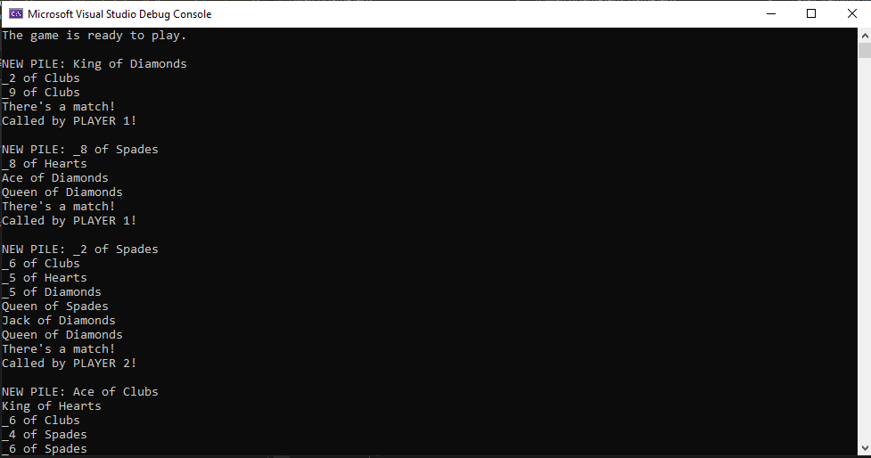

# "Match!" Card Game Simulation
## Description
This repo a solution for the "Match!" card game task (the rules of which I will not repeat in detail here) implemented as a .NET 8 console app. This codebase illustrates a first attempt at implementing a design for that task within some time constraints. 

Loosely, the program takes in parameters for how many standard packs of cards one wants to play the game with, and the rule for matching: whether that's by value, by suit, or both value and suit. It then _simulates_ two players playing the game until no more cards can be taken.   

More detail about the initial design, implementation, and some retrospective self-analysis of this attempt can be found in the Pull Request where the initial development has taken place. 

## Usage
Ordinarily, in a console app UI, the user would be prompted for the input arguments required for the program to operate, these would be parsed accordingly and utilsed thereafter. I reached beyond time limit to implement this detail, and so the input parameters require hard coding in the `Program.cs` file: 

```csharp
//Take some console readline input for matchRule and number of packs of cards.
// (hardcode for now)
int numofPacks = 3;
MatchRuleEnum chosenRule = MatchRuleEnum.SUIT;
```
Where the `numOfPacks` can be any postive, non-zero integer, and the `chosenRule` can be `SUIT`, `VALUE`, or `FULL`;

The `MatchGame` project/program can then be run using Visual Studio, another IDE, or the `dotnet run` command. 

Output akin to the following screenshots should be seen on the console, when the match rule is set to match on `SUIT`: 
### Game Start


### Game Complete


## Support
If any bugs are found, please contribute these findings to the Issues in Github. They will be addressed from there. 

Contributions are welcome via Pull Requests. 